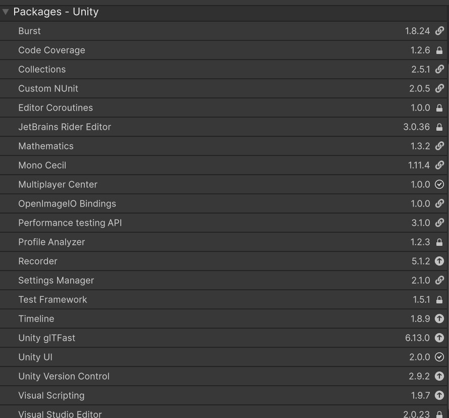

# 3DURP-Unity6057f1-Template

Base template for new Unity projects using the Universal Render Pipeline.

## Tech Stack

* **Unity:** 6000.0.57f1
* **Render Pipeline:** Universal Render Pipeline (URP)
* **Project Type:** 3D
* **Target Platform:** Windows Desktop (default)

## Purpose

This repository provides a clean starting point for Unity projects with:

* a clear folder structure
* URP setup
* version control readiness
* scalable project organization

## Project Structure

```text
Assets/
  MyGame/
    Scenes/
    Scripts/

  Settings/
```

## Conventions

* All project-specific content goes into Assets/MyGame/
* Avoid placing custom files directly in Assets/
* Use clear, consistent names
* Keep scenes, scripts, and prefabs organized by purpose

## Getting Started

1. Clone the repository
2. Open the project in Unity 6000.0.57f1
3. Check Needed-Packages and download the missing ones: 
4. Open the main scene:
Assets/MyGame/Scenes/WindmillsRGB
5. Press Play

## Build

1. Open File > Build Profiles
2. Add the required scenes
3. Select target platform
4. Build or Build and Run

## Version Control

This project is intended to be used with Git.

Do not commit:

* Library/
* Temp/
* Logs/
* Obj/
* Build/
* UserSettings/

## Coding Conventions

* PascalCase for classes and methods
* camelCase for variables
* One class per file
* File name matches class name
* Avoid magic numbers

## Scene Conventions

* Use one clear entry scene
* Keep hierarchy clean and structured
* Remove unused objects and assets

## Dependencies

Managed via Unity Package Manager.

Typical packages:

* Universal RP
* Input System
* TextMeshPro

## Collaboration

Recommended workflow:

1. Create feature branch
2. Implement changes
3. Review and merge into main

## Start Instructions

1. Open the Unity Hub
2. Open the project pgv4-tower using Unity version 6000.0.57f1
3. Open the Scene in the Project Window: 
	Assets/MyGame/Scenes/WindmillRGB
4. Press the Play button in the Unity Editor to start the Game
5. The Game will start in Play Mode
6. To switch screens, select Display 2 in the upper-left corner of the Game View window

## Windows Build

1. Open the Unity Editor
2. Go to File > Build Profiles
3. Open the "Windows" profile and press "Activate" if it is not already active
4. Press "Open Scene List"
5. If you are currently in the "WindmillsRGB" scene, press "Add Open Scenes"
6. If you are not in the correct scene, open it first (see "## Start Instructions")
7. Go back to the Windows profile and verify the following settings:
	- Architecture: "Intel 64-bit"
	- Build and Run on: "Local Machine"
	- Compression Method: "Default"
	- No checkboxes selected
8. Press "Build" and choose any folder as the output directory

## Bedienung und Beenden der Anwendung

Die Anwendung wird über den Touchscreen bedient.
Die Anwendung kann jederzeit mit der Taste `Q` beendet werden.
Zusätzlich gibt es einen versteckten Touch-Bereich in der linken oberen Ecke des Bildschirms. Dieser ist speziell für den Ausstellungsbetrieb vorgesehen damit man die Anwendung über diesen Bereich ebenfalls zu jeder Zeit beenden kann. Dazu muss der Touch-Bereich mindestens 5 Sekunden lang gedrückt gehalten werden, damit eine unbeabsichtigte Beendung verhindert wird.

## Project Description

1.Projectgoal
With this project, we are building an interactive game for kids to learn how
additive color mixing (the RGB process) works in a playful way. The children have
to mix a given target color as accurately as possible. By blowing into the
windmills using a straw, they control the intensity of the colors Red, Green, and
Blue coming out of each mill.

2.Pepper's Ghost
The visuals are based on the classic illusion trick called "Pepper’s Ghost". A
hidden monitor reflects the image onto a diagonally mounted, semi-transparent pane.
For the kids, it creates the illusion of a 3D hologram floating freely in mid-air,
which they can interact with just by blowing.

3.Use Case
This project is designed as an interactive exhibition installation, perfect for
things like museums, science workshops, or open house days.
